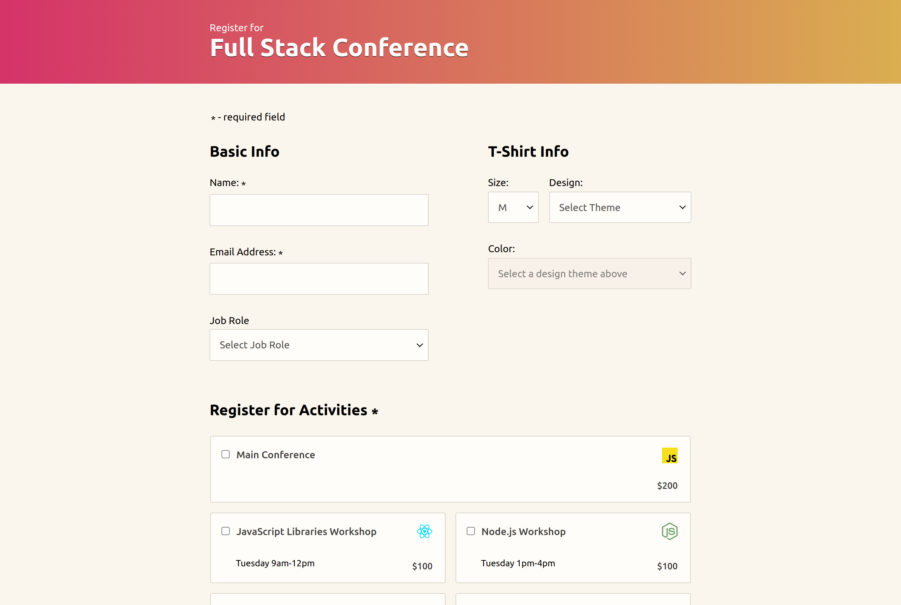

# FSJS - Interactive Form

This is my project 3 solution in the Treehouse FSJS techdegree. Below is a list of features added on top of the project requirements.

| Extra features         | Description                                                                      |
| :--------------------- | :------------------------------------------------------------------------------- |
| Real-time validation   | Validate required fields on input or change                                      |
| Conditional errors     | Run tests for the name and email input and display a hint to pass the validation |
| Conflicting activities | Disable options with conflicting times                                           |
| JSDoc documentation    | Most functions are documented with JSDoc                                         |

Preview: 

Live URL: [Solution](https://kalrog-dev.github.io/fsjs_interactive_form/)